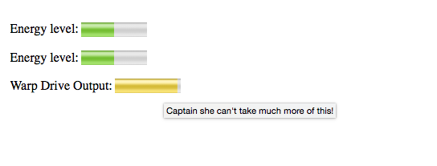

<section data-markdown>
<script type="text/template">
#Meter
This HTML5 element defines a scalar measurement within a known range, similar to what might be represented by a gauge.
</script>
</section>

<section data-markdown>
<script type="text/template">
###HTML5 Standard Syntax
```
<meter 
    accesskey="spaced list of accelerator key(s)"   
    class="class name(s)"   
    contenteditable="true | false | inherit"   
    contextmenu="id of menu"  
    data-X="user-defined data"   
    dir="ltr | rtl" 
    draggable="true | false | auto" 
    hidden="hidden" 
    high="float" 
    id="unique alphanumeric identifier" 
    itemid="microdata id in URL format" 
    itemprop="microdata value" 
    itemref="space-separated list of IDs that may contain microdata" 
    itemscope="itemscope" 
    itemtype="microdata type in URL format" 
    lang="language code" 
    low="float" 
    max="float" 
    min="float"
    optimum="float" 
    spellcheck="true | false" 
    style="style information" 
    title="advisory text" 
    tabindex="number" 
    value="float" >
</meter>
```
</script>
</section>

<section>
<h3>HTML5 Standard Syntax</h3>
<pre>
<code>
&lt;meter 
    accesskey="spaced list of accelerator key(s)" 
    class="class name(s)" 
    contenteditable="true | false | inherit" 
    contextmenu="id of menu" 
    data-X="user-defined data" 
    dir="ltr | rtl" 
    draggable="true | false | auto" 
    hidden="hidden" 
    high="float" 
    id="unique alphanumeric identifier" 
    itemid="microdata id in URL format" 
    itemprop="microdata value" 
    itemref="space-separated list of IDs that may contain microdata" 
    itemscope="itemscope" 
    itemtype="microdata type in URL format" 
    lang="language code" 
    low="float" 
    max="float" 
    min="float"
    optimum="float" 
    spellcheck="true | false" 
    style="style information" 
    title="advisory text" 
    tabindex="number" 
    value="float"&gt;
&lt;/meter&gt;
</code></pre>
</section>

<section data-markdown data-render=book>
<script type="text/template">
###HTML5 Event Attributes
> onabort, onblur, oncanplay, oncanplaythrough, onchange, onclick, oncontextmenu, ondblclick, ondrag, ondragend, ondragenter, ondragleave, ondragover, ondragstart, ondrop, ondurationchange, onemptied, onended, onerror, onfocus, onformchange, onforminput, oninput, oninvalid, onkeydown, onkeypress, onkeyup, onload, onloadeddata, onloadedmetadata, onloadstart, onmousedown, onmousemove, onmouseout, onmouseover, onmouseup, onmousewheel, onpause, onplay, onplaying, onprogress, onratechange, onreadystatechange, onscroll, onseeked, onseeking, onselect, onshow, onstalled, onsubmit, onsuspend, ontimeupdate, onvolumechange, onwaiting
</script>
</section>
<section data-markdown data-render=both>
<script type="text/template" >
###Element-Specific Attributes
* `low` This attribute holds a float value that indicates the low range of the measurement.
* `max` This attribute holds a float value that indicates the maximum range of the measurement.
* `min` This attribute holds a float value that indicates the minimum range of the measurement.
* `optimum` This attribute holds a float value that indicates the optimum range of the measurement.
* `value` This attribute holds a float value that indicates the current value of the measurement.
</script>
</section>
#### Examples
<section>

</section>

<section data-markdown>
<script type="text/template">
###Image Example:

</script>
</section>

<section data-markdown>
<script type="text/template">
###Notes
* The assumption is that values are used in the correct sense; for example, a min value cannot be greater than a max value, a low value can’t be greater than a high value, an optimum value cannot be greater than a high value, and so on.
</script>
</section>