#Chrome Tracing 

###What is Chrome Tracing
**_Chrome Tracing_** is tool that web developer can use to measure performance and see how web pages get rendered into the browser. 
Chrome tracing has many cool features. For example, you can measure the RAIL of your website. It also allows you to see how the ServiceWorker is working. 
Thats not the only thing, Chrome tracing lets you see the actule drawing of the web pages. It also showes you the Chrome GPU where the GPU showes the time it takes to deliver the graphics. 

The picture below is just an overview of chrome tracing
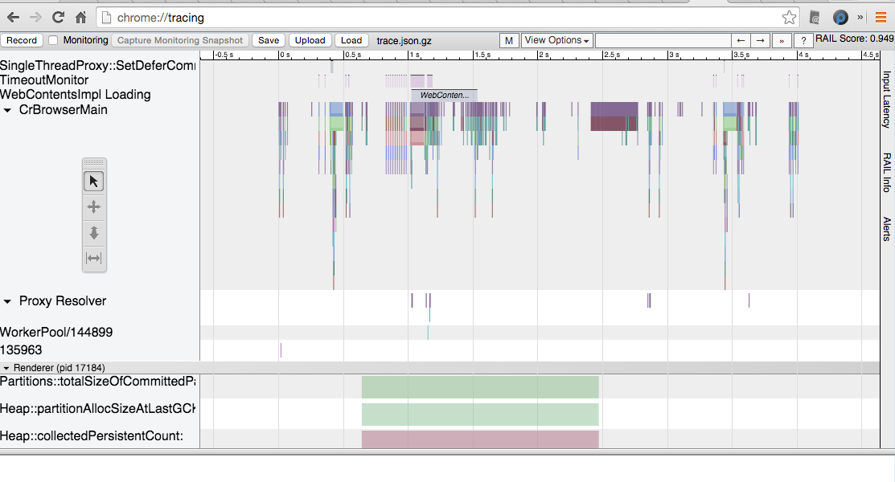

The following image is demonstrating some of the Tracing data.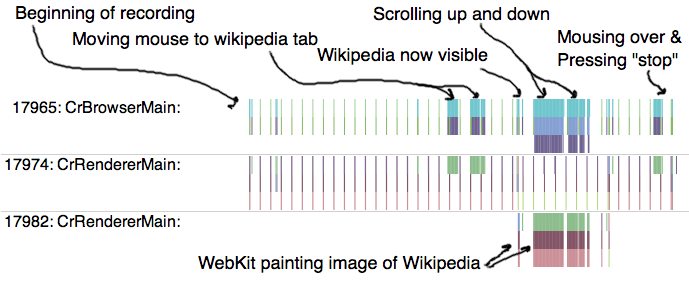

### How to Use Chrome Tracing?
Open Google Chrome, and in the URL bar type the following `chrome://tracing`.
The following window will open. 
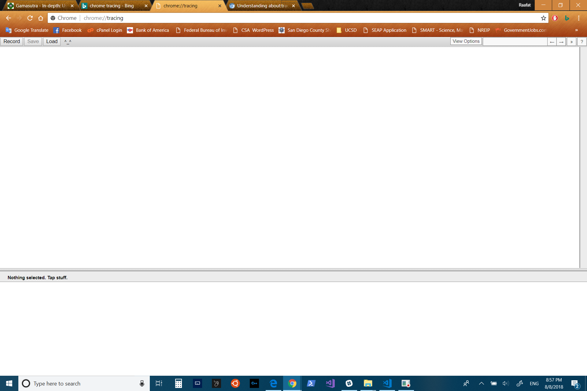

Now there are few ways to run Chrome Tracing. 
1. From Recod (Which it is the most common)
2. From Load and it takes a JSON file.

If you click on Recode the following window will pop up. 
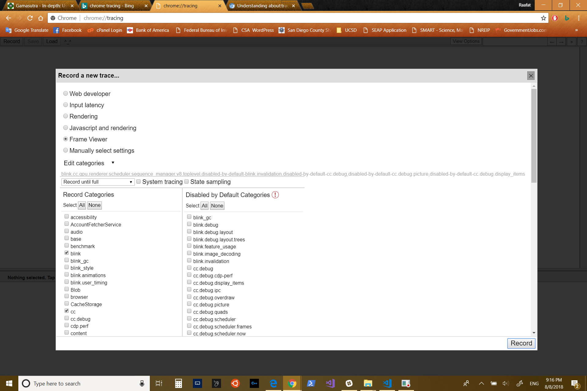

As you can see there are many options. You can start from seeing Input latency, Rendering, Javascript and rendering, Fram Viewer, or Manually select settings. Under the manually select sttings, you can see many other options. For example, you can see the GPU, RAIL, and ServiceWorker. 

When I was doing this tutorial, I was interested in Frame Viewer. Because I was trying to see how the web Pages get painted to the browser. 

After you select the option you like to see and measure, click Record at the bottom right corner. The following window will pop up. 
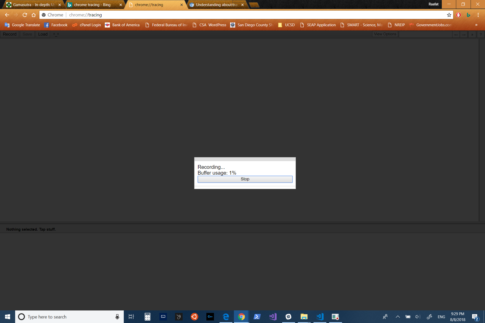

After this window shows up, go and open a new tab and navigate to the website that you are trying to measure. 
I was useing the Homework 4 from my CSE 134B class [Click Here to see it](https://cse134bproject1-a22ef.firebaseapp.com/Project%204/index.html).

After you open the website that you are trying to measure, you can play with it as you like, and after few seconds or even a minute you can go back to the recoding tap and hit stop.

After hitting stop, let Chrome Tracing do its job, and something like this will pop up. 
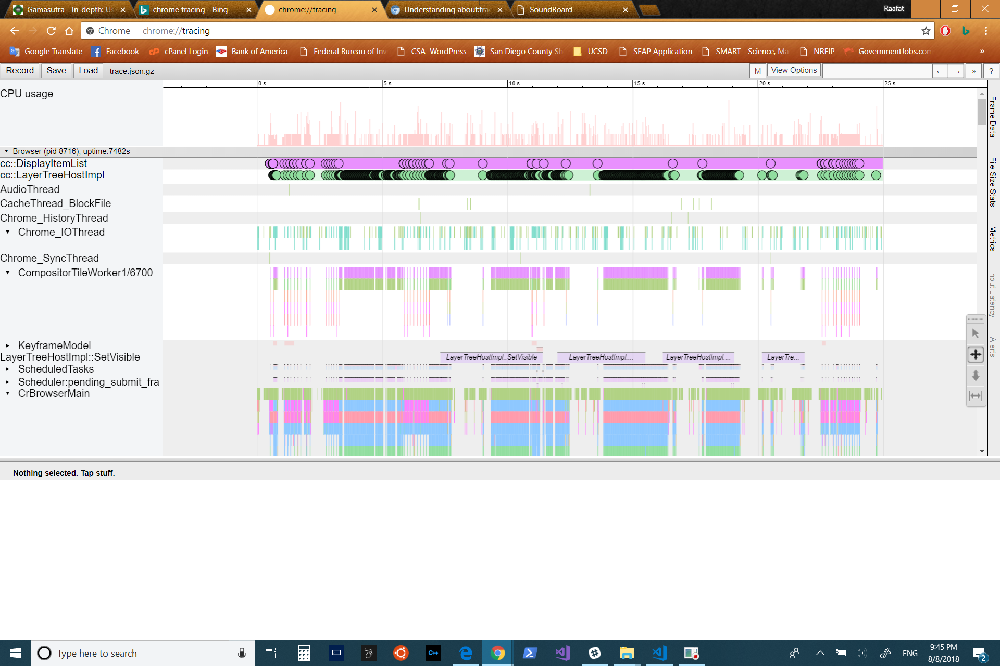

Now we use w,a,s,and d in the keyboard to navigate around the Chrome Tracing Data. W is used to zoom-in, A is used to go left, S is used to zoom-out, and D is used to go right. 

Now you can zoom-in and see every little detail that is happening in every seconds. The following pictures show some of the playing in Chrome Tracing. 

This is basic wirring for the browser, and how things are getting painting 
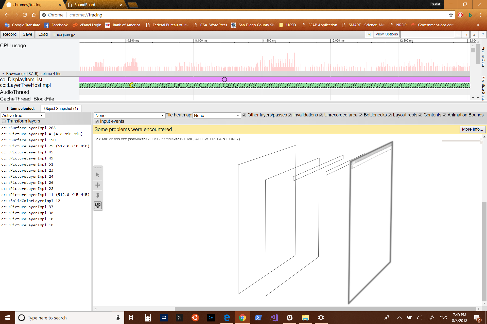

This picture is showing how the painting start to happened from the top. 
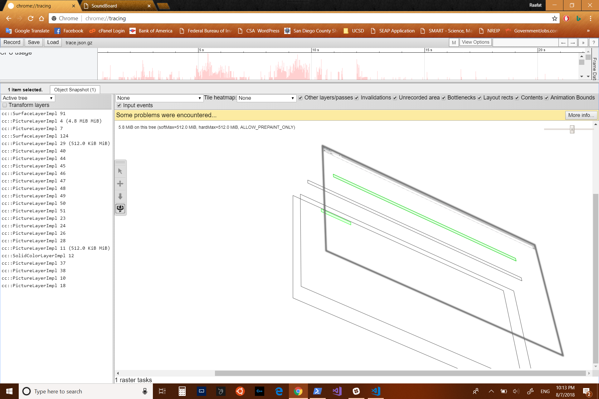

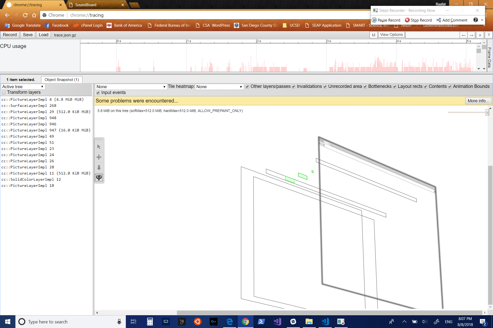

This picture here shows the tiles of my music board.
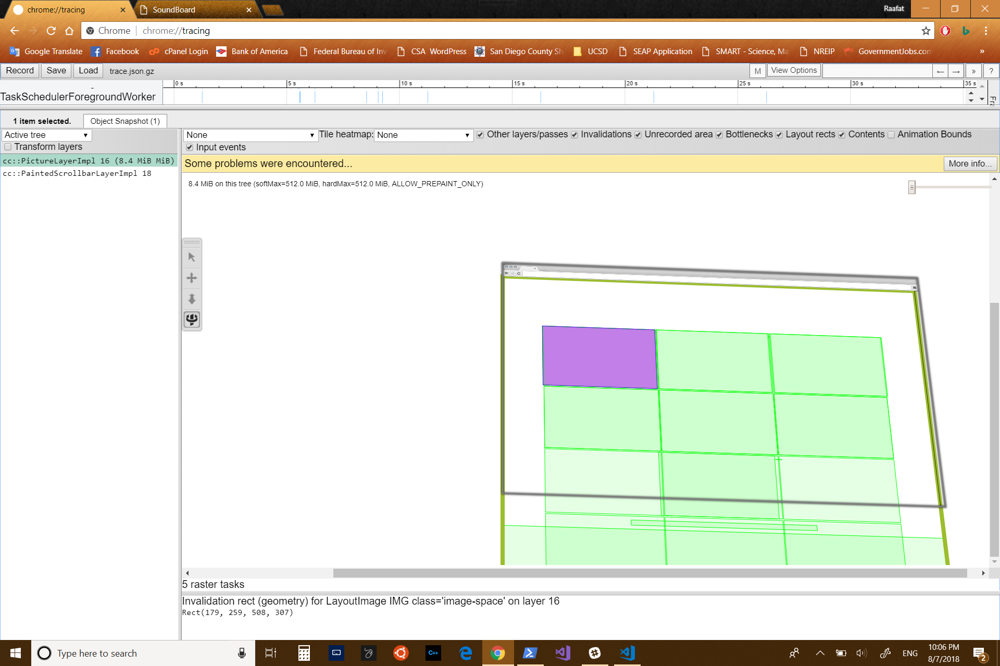
The purple one was the one I clicked it. If you look carefully, I have more things at the bottom. I have two different sets of music, but secondary set has hidden property so that it load faster for the user when needs it. 

The following picture shows the tiles in 3D
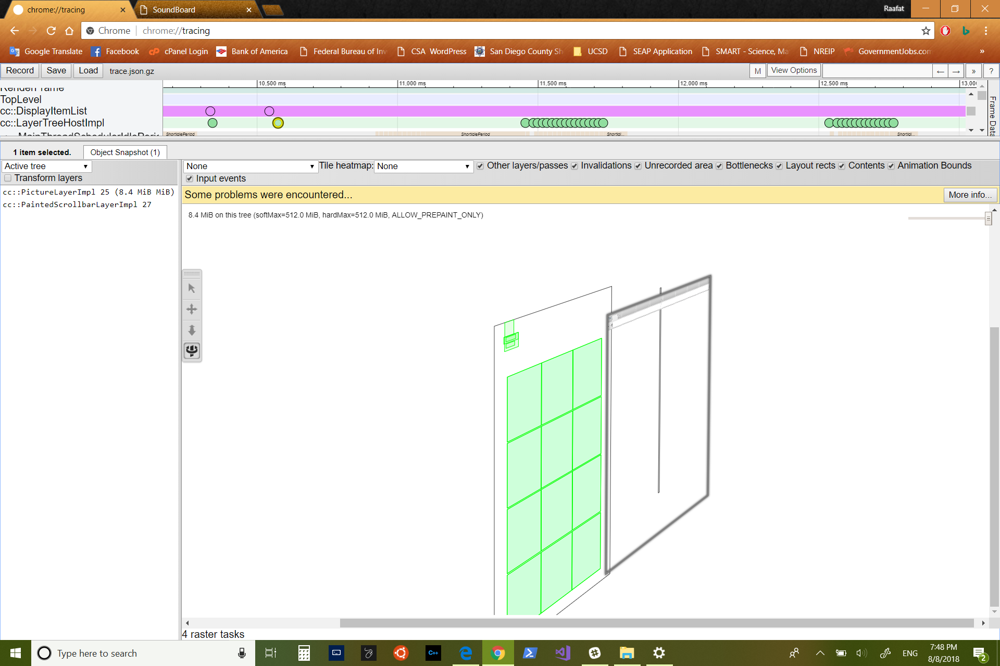