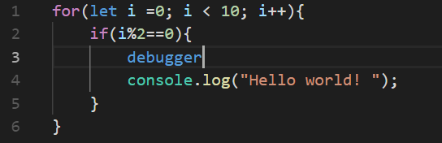
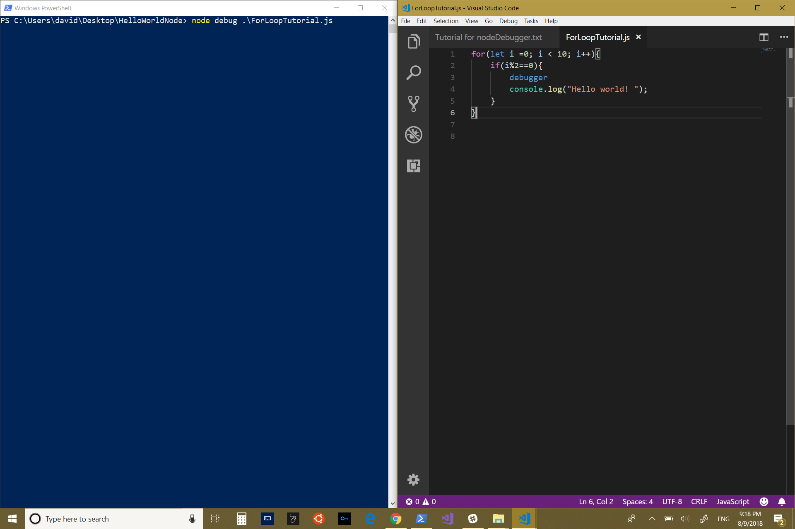
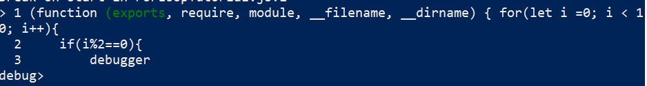
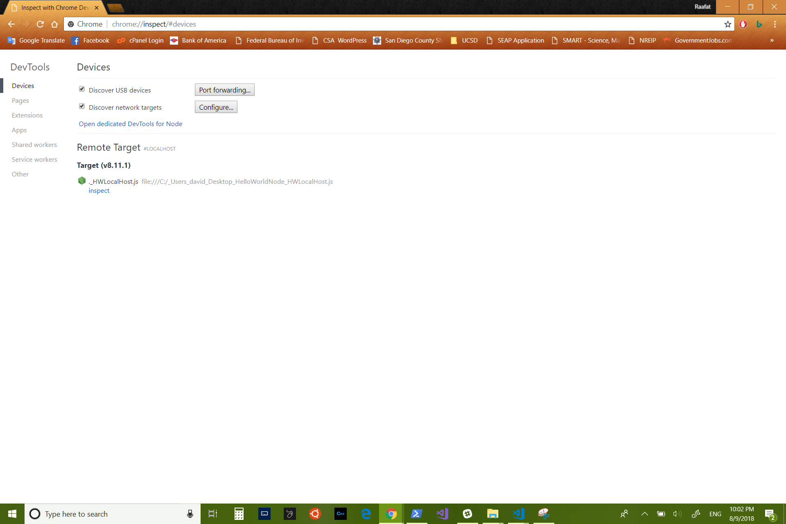
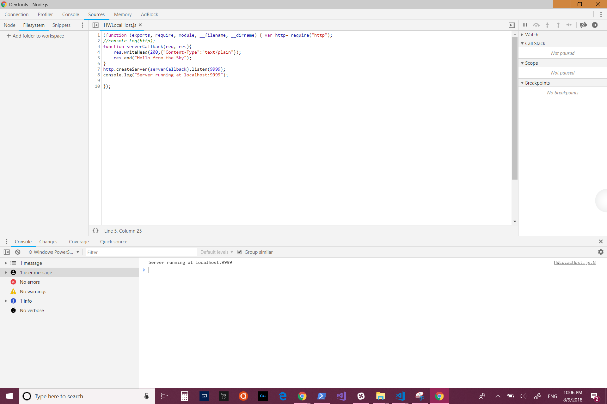
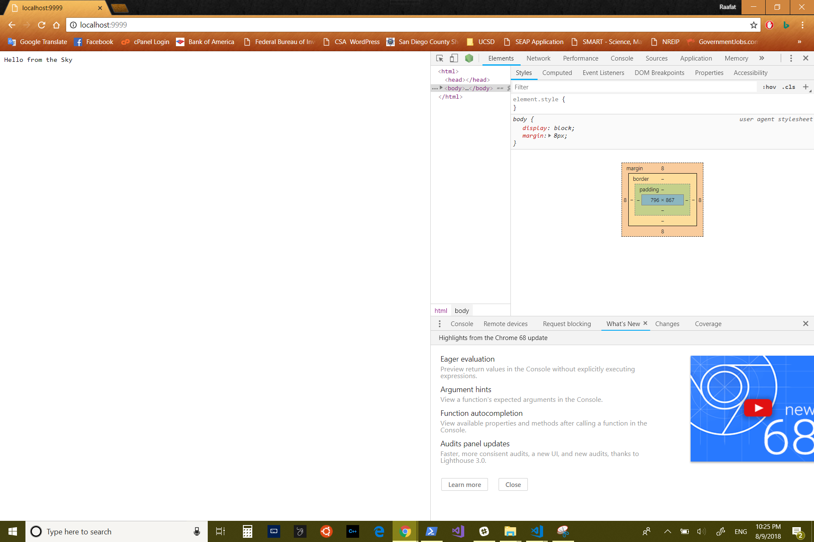
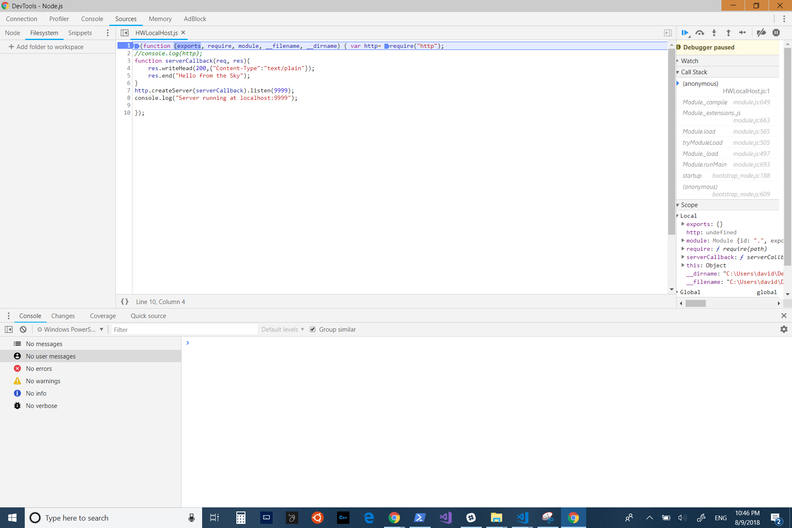

#Debugging Node JS using Chrome DevTools 

The are few ways to debug your Node Js code. 
The first way, which it is classic way is using the terminal. 
In your code you can put the word `debugger`. The word `debugger` is considered as breakpoint. After you insert the breakpoint, you run the following commend on the terminal `node debug nameOfYourJSFile.js`. After that you can using the following commands to walk through your code.

The following picture is showing simple NodeJS file that has for loop and an if statement and console.log to print "Hello World".

If you look carefully I have debugger statement inside my if statment. 

On the left window, we have the terminal, and I am about to run the debug command. 

After I run the commend, I will get the following result.

Now anything that turn its color to green means the debugger is at that line. 

Now to navigate your code while you are in the debugging mode.
* `c` => continue with code execution
* `n` => execute this line and go to the next line
* `s` => step into this function
* `o` => finish function execution and step out

The second way is using Chrome Devtools. Now there are few ways to run it. 

One way is by typing `node --ispect NodeJSFile.js something like this will show in your terminal

Using this commend the debugger will stop at the first breakpoint you have. If the ispecter did not see any breakpoits will stop at the first line. 

Go to chrome and type in the URL area `about://inspect`. The following window will appear. 

Click on either `Open dedicated DevTools for Node` or at the Remote Targer section where it says `inspect`. Both ways should give you the same result as of the following picture. 

The other way of running Node Js in Chrome DevTools is by forcing the inspecter to break at the first line. We can do that by running the following commend in the terminal `node --inspect-brk NodeJSFile.js` 

Now if you are in the inspect tool already and ran the above command you do not need to type the `about://inspect` 

If you look at the left corner of inspect tool in the following picture, you will see the Green Node Logo, and by clicking on it, the debugger window will open. 

All that was just to show different ways of openning the debugger using Google DevTools. Now lets talk about the actual use of the DevTools. 

Now we can insert breakpoint by clicking on the numbers to the left of your code. The dark baby blue arrow means there is breakpoint there. 

Now if you look carefully there are two breakpoints in the first line. One start at the function, and two that is at require. The arrows at tho right, are use for c, n, s, and o that I explain above. If you click on the arrow that is pointing to bottom will run next commend, and since we have breakpoint at the require it will go inisde the Node core functions, and it shows you how the require get import it.

Now if you are not intrested in knowing how the things work at the bottom, you can right click and chose blackbox script, so when it runs, it will execute all the bottom functions without showing you or without stepping inside those files. 

You also can do live edit by changing what ever you like, and then hit `ctrl+s` (make sure you are not in pause mode) then refersh the localhost. 

