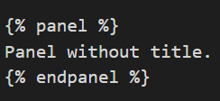
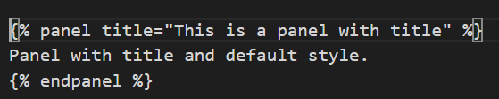
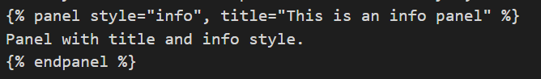
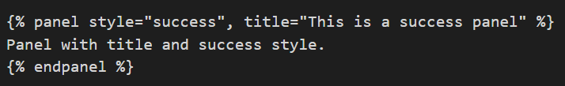
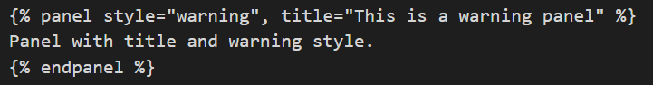
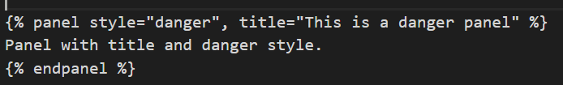

#How to Use Panel Plugin

**_Note:_** If you already installed the panel plugin, you can start from step 3. Otherwise start from step 1.

1. In book.json file, add `"plugins": [ "panel" ]`

2. Go to the terminal and type `gitbook install`

3. If you want to have a panel with no title, you can follow the following code, 




4. If you want to have a panel with title, you can follow the following code,
 
 
 

5. If you want to have a panel with info style, follow the following code,
 
 
 

6. If you want to have a panel with success style, follow the following code,




7. If you want to have a panel with warning style, follow the following code,




8. If you want to have a panel with danger style, follow the following code,
 
 
 

