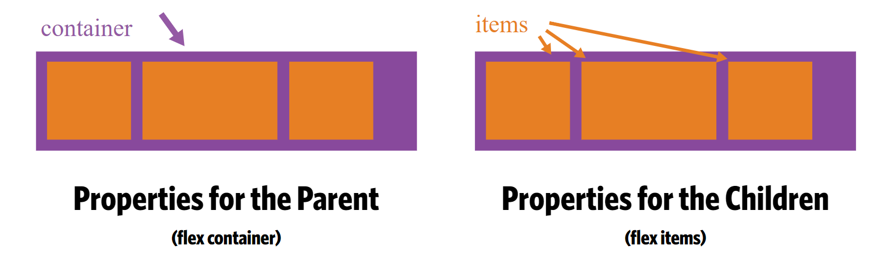

#FlexBox fundamentals

**What is FlexBox?**

Accourding to Mozilla Developer,

 > "The Flexible Box Module, usually referred to as flexbox, was designed as a one-dimensional layout model, and as a method that could offer space distribution between items in an interface and powerful alignment capabilities."

Accourding to sitepoint, 

 > "flexbox, is a layout mode providing for the arrangement of elements on a page such that the elements behave predictably when the page layout must accommodate different screen sizes and different display devices."

Some other people descriped flexbox as following,

 > "A flex container expands items to fill available free space, or shrinks them to prevent overflow. Most importantly, the flexbox layout is direction-agnostic as opposed to the regular layouts (block which is vertically-based and inline which is horizontally-based)."

Now all these are valid definitions. We can summaries all of them in few bullet points. Flexbox is a
 * Container
 * One Dimensional or Two Dimentional for tables
 * Vertical or Horizontal
 * Shrink or Grow 

Please keep in mind that flexbox is not a single property huge segment. This segment has it is own properties.Since we know flexbox is a container, some of these properties are made for flex container, and some other properties are made for the flex items. 

<section>
  
</section>

Now let's look at the above example, and discuss it in details.

I will start from the css or the style tag under the head tag. From line 6 to line 19, thoes lines do not have to do anything with the flexbox. Also those lines are some styles and colors to make the example little fun. 

If you click on the result to see what this code is doing. You will see 5 different colors in top of each other, and inside each one is a number. Thus because we are using 5 divs, and we are giving each one of these div a different background color. 

The flexbox start from line 22. Uncomment line 23 `disply:flex`, and click on the result one more time. 
When you run line 23, that turn the div in line 34 to become the parent or what we call it the flex container, and immedetly anything comes inside that div become children or what we call it flex items. Keep in mind, we are using divs for illustration purposes. In addition, the classes inside the nested divs (Line 35 to 39)are just for illustration purposes, and they do not have to do anything with flexbox. 

Now you might be wondering, and saying what in the world happened? How those boxes changed and become so small. In fact those boxes did not become so small automatically, those boxes changed base on the font-size. Shrinking or Growing is one of the flexbox property. 

Now the definition of display 

`display:flex` is the command that define the flex container. 

Now let's uncomment line 24, click result and let's see what will happened? Yes, you are right. We have a border around the flex container. Which it means, my container goes across the page. Now what if I do not like that, or I want my border to be around the content only. We can change line 23 from `display:flex` to `display:inline-flex`.

##Flex-Direction

Now we have a new topic which we call it Flex-Direction. Flex-Direction is a little bit confusing, and I'll try to simplify it. 

I am going to use our original example to so that we are familiar with code. 

Let's look over the following picture and defined few terms to be all at the same page. 

* **main axis** - is the primary axis along which flex   items are laid out. Beware, it is not necessarily horizontal; it depends on the flex-direction property.

* **cross axis** - is perpendicular to the main axis. Its direction depends on the main axis direction.

* **main-start | main-end** - The flex items are placed within the container starting from main-start and going to main-end.

* **cross-start | cross-end** - Flex lines are filled with items and placed into the container starting on the cross-start side of the flex container and going toward the cross-end side.

<section>
  
</section>

In total, we have four directions. Let's look at each one separately with respect to **main axis** and **cross axis**

Now go a head and uncomment line 25 `flex-direction:row;`, and click on result. Yes, nothing happened because `flex-direction:row;` is the default value for any flex container. Which it means, all flex items will be next each other strating from the left of main axis going in the right direction of the main axis. The cross axis is going from the top to the bottom. 

Now go a head and uncomment line 26 `flex-direction:column;`, and click on result. `flex-direction:column;` will put all the flex items in the column view (One in top of each other instated of next to each other). Keep in mind if you changed the direction, now you are changing the axises too. Therefore, your main axis is now going from TOP to BOTTOM. The reason for that is your items changed its directions.

Now go a head and uncomment line 27 `flex-direction:row-reverse;`, and click on result. `flex-direction:row;` switch the direction of the default view, and make it goes from right to left. Which it means, all flex items will be next each other strating from the right of main axis going in the left direction of the main axis. The cross axis is going from the top to the bottom.

Now go a head and uncomment line 28 `flex-direction:column-reverse;`, and click on result. `flex-direction:column-reverse;` will put all the flex items in the column view starting from the last item. Since we changed the direction now the axis is changed also. Therefore, your main axis is now going from BOTTOM to TOP. 

##Wrapping Elements

Now if you remember at the beginning of the tutorial, I said that each box is taking the width of its content. Which in this case, it is the number at each box. Thoes numbers have 100px as their font size. What about if I want to give it more width without changing the font size. What about if I want to design my own boxes with my own sizes without depending on its content. Do not worry this is flexbox, and it is so flexiable. I am also going to use our same example so that we are familiar with the code. 

Uncomment line 27, and click result. You will not see any changes in the look. Therefore, `flex-wrap: nowrap;` is the defualt view of flexbox. 

Go a head and uncomment line 13, and click result. What you see now is there no more white space left over. However let's do a little calcuation. We have five boxes and each we give it 500px. If we multiply 500 by 5, we get 2500px. I do not know about your computer, but I definitely do not have 2500px in my screeen. So what is happenning here? 

The answer is simple. Flexbox is nice, and trying to make us do less work and continue with the beautiful look. By default, flexbox is trying to fit all its children in one line.

<section>
  
</section>

Now let's go and change the line 13 from 500px to 200px and let's click on result and see what it will happened. 

Now since we have line 28 uncomment, and we changed the width of each box. The flexbox will take the width of each box and when it cannot fit it any more will take it to the next line. 

Let's uncomment line 29, and click result, now you might be thinking that this will filp the order of the items. 

However, this will reverse the items through the cross axis not through the main axix. 

