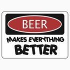
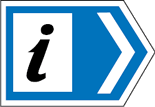

#Testing Plugins (Testing Zone)

## Testing Panel Plugin
### Note: I added "panel" to book.json file under the plugins array on 7/16/2018


Panel without title.
This just a box. 
**_Can we use italic and bold?_** The answer is YES.
**_Can we use links?_** [The answer is YES](www.google.com)
**_Can we use images?_** 



Panel with title and default style.
**_Note:_** The title cannot be bold and or italic
**_Can we use italic and bold?_** The answer is YES.
**_Can we use links?_** [The answer is YES.](www.google.com)
**_Can we use images?_** 



Panel with title and danger style.
**_Note:_** The title cannot be bold and or italic
**_Can we use italic and bold?_** The answer is YES.
**_Can we use links?_** [The answer is YES](www.google.com)
**_Can we use images?_** 



Panel with title and info style.
**_Note:_** The title cannot be bold and or italic
**_Can we use italic and bold?_** The answer is YES.
**_Can we use links?_** [The answer is YES](www.google.com)
**_Can we use images?_** 



Panel with title and success style.
**_Note:_** The title cannot be bold and or italic
**_Can we use italic and bold?_** The answer is YES.
**_Can we use links?_** [The answer is YES](www.google.com)
**_Can we use images?_** 



Panel with title and warning style.
**_Note:_** The title cannot be bold and or italic
**_Can we use italic and bold?_** The answer is YES.
**_Can we use links?_** [The answer is YES](www.google.com)
**_Can we use images?_** 


 

##The result: the plugin is workin %100.


# Testing Interactive quizzes in a gitbook
### Note: I added "quizzes" and "exercises" to book.json file under the plugins array on 7/16/2018


Quizzes need to start and finish with a separation bar (--- or *****).


---

Here's a quiz about Gitbook

|     Question     | Good | Bad |
| ---------------- | ---- | --- |
| What is Gitbook? | (x)  | ( ) |

> Gitbook is good

What does Gitbook support?
- [x] Table-based questions with radio buttons
- [x] Table-based questions with checkboxes
- [ ] Telepathy
- [x] List-based questions with checkboxes
- [x] List-based questions with radio buttons
- [ ] Moon-on-a-stick

> Gitbook supports table and list based quiz questions using either radio buttons or checkboxes.
>
> Gitbook is not telepathic and does not give you the moon on a stick.

---


Interactive quizzes in a gitbook plugin is on hold because I was able to see some better plugin. 


# Testing gitbook-plugin-quiz

    To test gitbook-plugin-quiz, I added the following to book.json.

    Under the "plugins", I added "quiz".
    Under the "pluginsConfig", I added

    > "quiz": {
            "labels": {
                "check"             : "Check my answers",
                "showExplanation"   : "Explain", 
                "showCorrect"       : "Show all",   
                "explanationHeader" : "Explanation"
            },
            "text": {
                "noChosen"    : "Choose at least one answer",  
                "incomplete"  : "Some correct answers are missing" 
            },
            "buttons": {
                "showCorrect"       : true, 
                "showExplanation"   : true 
            }
    }  
 

<quiz name= "Quiz time, This is the title of the quiz" >
    <question multiple>
        
What does IWT use?

        <answer correct> Markdown</answer>
        <answer correct> gitbook</answer>
        <answer> CSS </answer>
        <explanation>The IWT uses Markdown language and gitbook</explanation>
    </question>
    <question>
        
 does it support True/False question? 

        <answer correct>Ture</answer>
        <answer> False </answer>
    </question>
    <question>
        
 
        does it support picture question?

        <answer>Ture</answer>
        <answer false> False </answer>
    </question>
    <question>
        
This is multiple dropdown quiz, in each dropdown select a correct number corresponding to the dropdown's order

        <answer>
            <option correct>First</option>
            <option>Second</option>
            <option>Third</option>
            <option>Fourth</option>
        </answer>
        <answer>
            <option>First</option>
            <option correct>Second</option>
            <option>Third</option>
            <option>Fourth</option>
        </answer>
        <answer>
            <option>First</option>
            <option>Second</option>
            <option correct>Third</option>
            <option>Fourth</option>
        </answer>
        <answer>
            <option>First</option>
            <option>Second</option>
            <option>Third</option>
            <option>Fourth</option>
        </answer>
    </question>
</quiz>