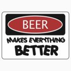

# Testing Zone

## Testing Panel Plugin
### Note: I added "panel" to book.json file under the plugins array on 7/16/2018


Panel without title.
This just a box. 
**_Can we use italic and bold?_** The answer is YES.
**_Can we use links?_** [The answer is YES](www.google.com)
**_Can we use images?_** 



Panel with title and default style.
**_Note:_** The title cannot be bold and or italic
**_Can we use italic and bold?_** The answer is YES.
**_Can we use links?_** [The answer is YES.](www.google.com)
**_Can we use images?_** 



Panel with title and danger style.
**_Note:_** The title cannot be bold and or italic
**_Can we use italic and bold?_** The answer is YES.
**_Can we use links?_** [The answer is YES](www.google.com)
**_Can we use images?_** 



Panel with title and info style.
**_Note:_** The title cannot be bold and or italic
**_Can we use italic and bold?_** The answer is YES.
**_Can we use links?_** [The answer is YES](www.google.com)
**_Can we use images?_** 



Panel with title and success style.
**_Note:_** The title cannot be bold and or italic
**_Can we use italic and bold?_** The answer is YES.
**_Can we use links?_** [The answer is YES](www.google.com)
**_Can we use images?_** 



Panel with title and warning style.
**_Note:_** The title cannot be bold and or italic
**_Can we use italic and bold?_** The answer is YES.
**_Can we use links?_** [The answer is YES](www.google.com)
**_Can we use images?_** 


 

##The result: the plugin is workin %100.


# Testing Interactive quizzes in a gitbook

Quizzes need to start and finish with a separation bar (--- or *****).

**_Note_** Prof. Powell did not like this plugin, so I stoped testing, and I deleted the
the quizzes and exercises from book.json.


---

Here's a quiz about Gitbook

|     Question     | Good | Bad |
| ---------------- | ---- | --- |
| What is Gitbook? | (x)  | ( ) |

> Gitbook is good

What does Gitbook support?
- [x] Table-based questions with radio buttons
- [x] Table-based questions with checkboxes
- [ ] Telepathy
- [x] List-based questions with checkboxes
- [x] List-based questions with radio buttons
- [ ] Moon-on-a-stick

> Gitbook supports table and list based quiz questions using either radio buttons or checkboxes.
>
> Gitbook is not telepathic and does not give you the moon on a stick.

---


Interactive quizzes in a gitbook plugin is on hold because I was able to see some better plugin. 


# Testing gitbook-plugin-quiz


    To test gitbook-plugin-quiz, I added the following to book.json.

    Under the "plugins", I added "quiz".
    Under the "pluginsConfig", I added

    > "quiz": {
            "labels": {
                "check"             : "Check my answers",
                "showExplanation"   : "Explain", 
                "showCorrect"       : "Show all",   
                "explanationHeader" : "Explanation"
            },
            "text": {
                "noChosen"    : "Choose at least one answer",  
                "incomplete"  : "Some correct answers are missing" 
            },
            "buttons": {
                "showCorrect"       : true, 
                "showExplanation"   : true 
            }
    }  
 

<quiz name= "Quiz time, This is the title of the quiz" >
    <question multiple>
        
What does IWT use?

        <answer correct> Markdown</answer>
        <answer correct> gitbook</answer>
        <answer> CSS </answer>
        <explanation>The IWT uses Markdown language and gitbook</explanation>
    </question>
    <question>
        
 does it support True/False question? 

        <answer correct>Ture</answer>
        <answer> False </answer>
    </question>
    <question>
        
 
        does it support picture question?

        <answer>Ture</answer>
        <answer false> False </answer>
    </question>
    <question>
        
This is multiple dropdown quiz, in each dropdown select a correct number corresponding to the dropdown's order

        <answer>
            <option correct>First</option>
            <option>Second</option>
            <option>Third</option>
            <option>Fourth</option>
        </answer>
        <answer>
            <option>First</option>
            <option correct>Second</option>
            <option>Third</option>
            <option>Fourth</option>
        </answer>
        <answer>
            <option>First</option>
            <option>Second</option>
            <option correct>Third</option>
            <option>Fourth</option>
        </answer>
        <answer>
            <option>First</option>
            <option>Second</option>
            <option>Third</option>
            <option>Fourth</option>
        </answer>
    </question>
</quiz>

 

##The result: the plugin is workin %100.


# Testing Click To Reveal Plugin 
**_Note:_** I added `"plugins":["click-reveal"]` to book.json

**_Note:_** I am hidding an image

    
    


**_Note:_** Click to reveal with custom text

    
    


**_Note:_** I am hidding a link 

    [Click to go to google](www.google.com)
    <a href="http://www.google.com">Visit Google</a>


**_Note:_** Click to reveal with custom text

    [Click to go to google](www.google.com)
    <a href="http://www.google.com">Visit Google</a>


**_Note:_** I am hidding a pop question from the quiz plugin 

    <quiz name= "Quiz time, This is the title of the quiz" >
        <question multiple>
            
What does IWT use?

            <answer correct> Markdown</answer>
            <answer correct> gitbook</answer>
            <answer> CSS </answer>
            <explanation>The IWT uses Markdown language and     gitbook</explanation>
        </question>
        <question>
            
 does it support True/False question? 

            <answer correct>Ture</answer>
            <answer> False </answer>
        </question>
    </quiz>


**_Note:_** I am hidding a text 

    IWT will be one of the best thing in world. Just watch :)


# Testing Interactive exercises in a gitbook
**_Note:_** added  `"plugins": ["exercises"]` to book.json


Define a variable `x` equal to 10.


var x =


var x = 10 


assert(x == 10) 



# Testing video plugins 
### Testing Google Drive Video
**_Note:_** I added `plugins: ["google-drive-video"]` to `book.json`

**_Note:_** The video should has the property of 'anyone with link can view'
https://drive.google.com/file/d/10D3EOKvQz5s1Lz2_jClHZHwUh8pG34yJ/view?usp=sharing

# Testing copy paste links
https://www.youtube.com/watch?v=O1-4u9W-bns

# Testing making markdown link
[show the video](../../../videos/MichaelBuble.mp4)

#Testing HTML5 video tag
1. ../../../videos/MichaelBuble.mp4

2. ../../../videos/MichaelBuble.mp4

3. ../../../videos/MichaelBuble.mp4

#Testing markdown video plugin
<video id="my-video" controls preload="auto" width="100%" height="100%" poster="MY_VIDEO_POSTER.jpg" data-setup="{}">
  <source src="../../../videos/MichaelBuble.mp4" type='video/mp4'>
</video>

